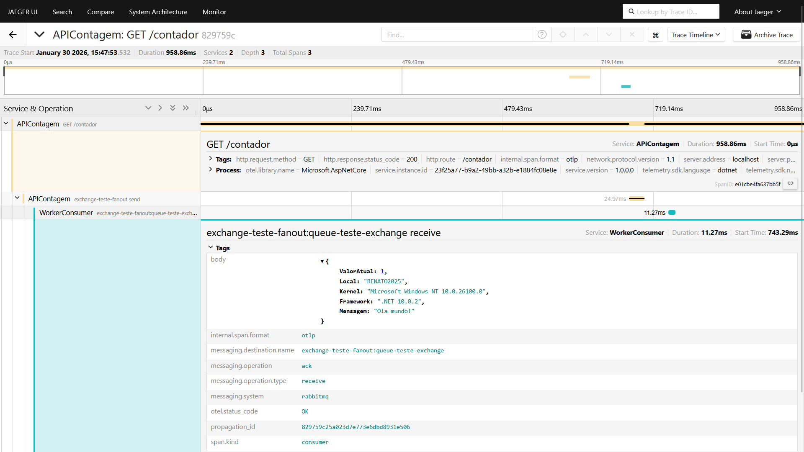

# aspnetcore10-producer-rabbitmq-exchange-fanout-otel-jaeger
Exemplo de API criada com .NET 10 + ASP.NET Core que simula um Producer do RabbitMQ, com envio de mensagens a uma exchange do tipo Fan-out e monitoramento via OpenTelemetry + Jaeger. Inclui script do Docker Compose para subida do ambiente de testes.

Aplicação consumidora utilizada nos testes: **https://github.com/renatogroffe/dotnet10-worker-consumer-rabbitmq-exchange-fanout-otel-jaeger**

Exemplo de telemetria gerada na comunicação entre essas 2 aplicações:

